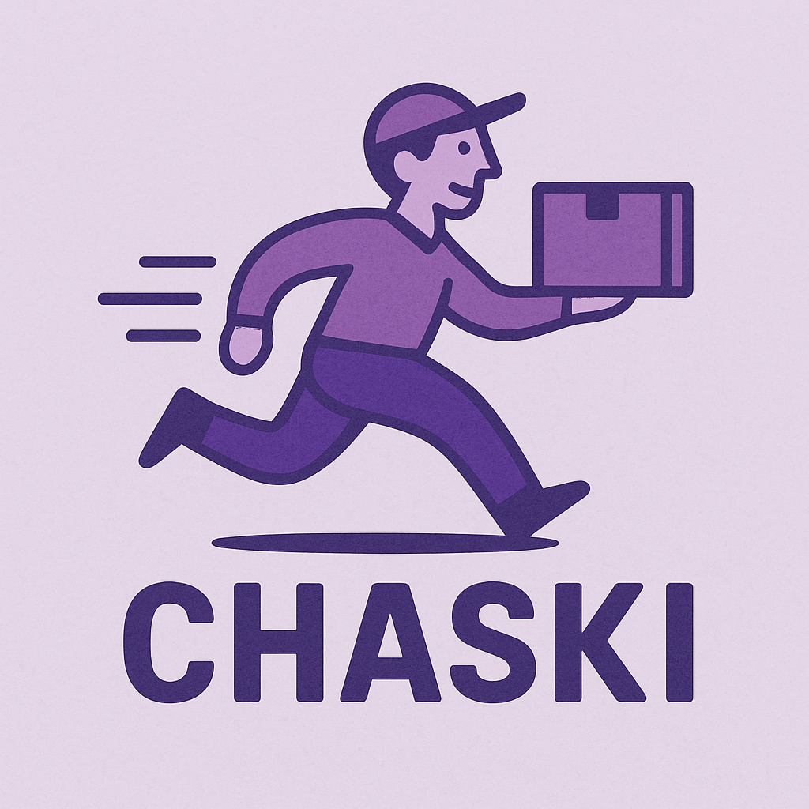

# Chaski - Sistema de Pedidos de Compras



**Chaski** es una solución innovadora para gestionar pedidos de compras de manera eficiente. Este sistema, desarrollado por **Yawar Express**, permite a los usuarios realizar pedidos de productos y servicios a través de una interfaz sencilla, mientras que el backend gestiona la lógica de negocio, las bases de datos y la seguridad. El sistema está basado en **Clean Architecture**, utilizando los mejores patrones de diseño como **Repository Pattern** y **Dependency Injection** para garantizar la escalabilidad y mantenibilidad del proyecto.

## Descripción

Chaski es una plataforma destinada a la gestión de pedidos de compras. A través de su interfaz fácil de usar, los usuarios pueden seleccionar productos, realizar pagos y recibir actualizaciones sobre el estado de su pedido.

Este proyecto está construido con las mejores prácticas de desarrollo de software, utilizando la arquitectura limpia (Clean Architecture) para asegurar que el código sea modular, escalable y fácilmente mantenible.

### Características principales:

- **Pedidos de compras**: Permite a los usuarios realizar y gestionar sus pedidos.
- **Gestión de inventario**: Control de stock y productos disponibles.
- **Pagos**: Integración con métodos de pago para procesar las compras.
- **Seguridad**: Implementación de prácticas robustas de seguridad en el backend.
- **Documentación de la API**: Generación automática de Swagger para una fácil integración con otros sistemas.

---

## Tecnologías Utilizadas

- **.NET 8**: El proyecto está desarrollado utilizando la última versión de .NET, lo que garantiza un rendimiento superior y acceso a las últimas características de la plataforma.
- **Clean Architecture**: Para garantizar una separación adecuada de responsabilidades y un código limpio y escalable.
- **Repository Pattern**: Para un acceso a datos desacoplado, facilitando pruebas unitarias y mantenimiento.
- **Dependency Injection**: Para gestionar las dependencias de manera eficiente y hacer el código más modular.
- **SQL Server**: Base de datos relacional para almacenar la información de los pedidos, usuarios y productos.
- **Swagger**: Documentación interactiva de la API para facilitar la integración y pruebas.
- **EF Core (Entity Framework)**: Para la gestión de la base de datos y la implementación del ORM.

---

## Instalación

Para instalar y ejecutar este proyecto en tu máquina local, sigue estos pasos:

### Requisitos Previos:

- Tener **.NET 8 SDK** instalado. Si no lo tienes, puedes descargarlo desde el sitio oficial de [Microsoft](https://dotnet.microsoft.com/download).
- Tener **SQL Server** instalado y configurado o utilizar una base de datos en la nube (Azure, AWS, etc.).

### Clonar el Repositorio:

```bash
git clone https://github.com/Nahuel-Nina-07/Chaski.git
cd Chaski
```
